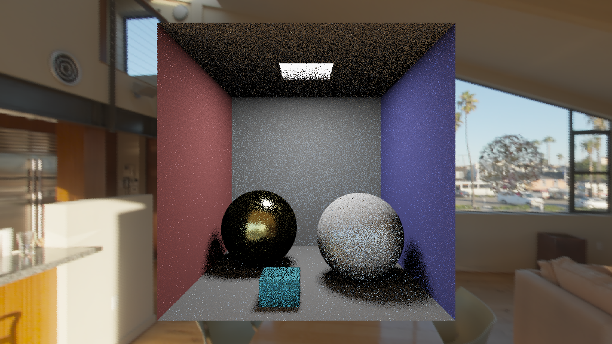
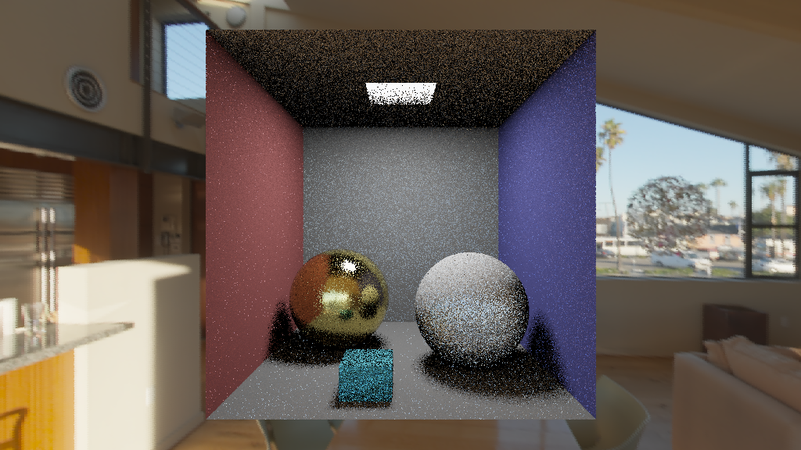
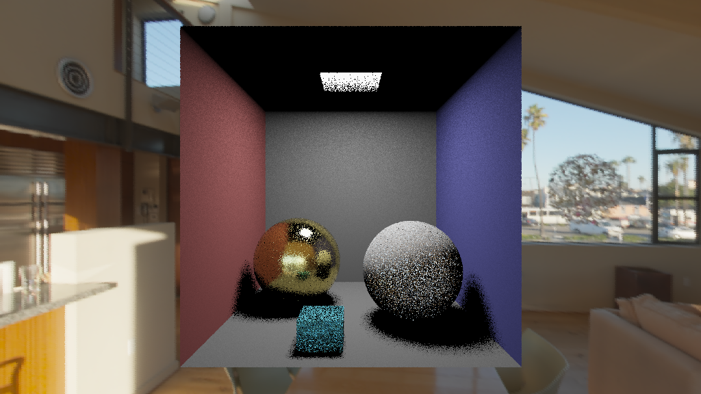
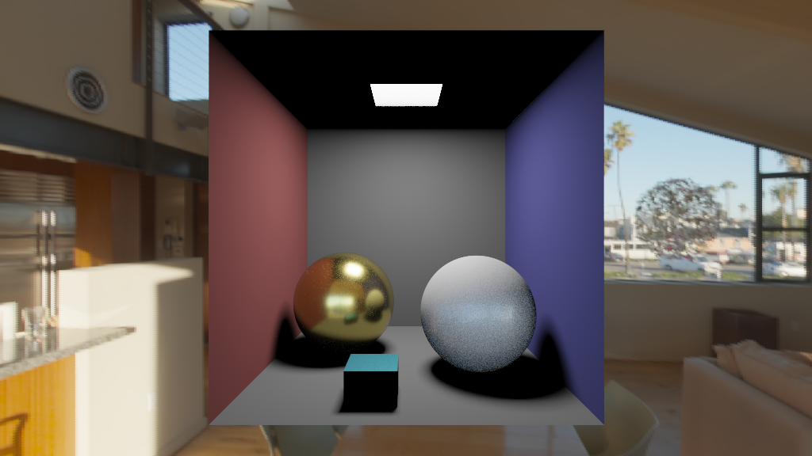

# 9. Ray Tracing

> Rainzor

## Content

- Implement path tracing algorithm.
- Importance sampling for environment map lighting.
- Set up scene (code, json) and render it

The requirements and methods based on the contents of two folders: `(1) documents` and `(2) project`.

### (1) Documentation `documents` [->](documents/) 

Requirements and some auxiliary materials for this assignment.

### (2) Source code `project ` [->](project/)

Basic code framework for this project (Complete).

## Rendering Result

Figure 1: Only direct light

    

Figure 2: Global Illumination

  

 
 

Figure 3: Global Illumination by important sampling

  

Figure 4: Global Illumination with high spp

  

## Reference

[1] [Framework](https://github.com/Ubpa/USTC_CG/tree/master/Homeworks/9_PathTracing)
